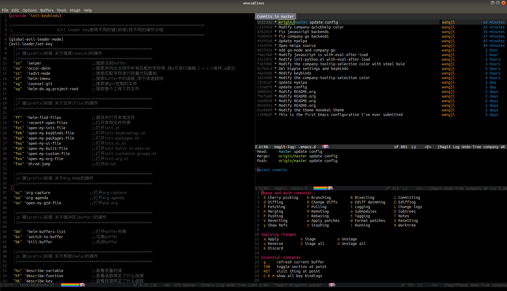

# This is my Emacs configuration
- Friendship tips: Installation effect of disconnection is better(支持断网安装,断网安装速度更快)
## Preview
- git

## Quick Start
`mv ~/.emacs.d ~/.emacs.d.bak` 
`git clone --depth 1 https://github.com/Wjinlei/.emacs.d.git ~/.emacs.d` 
- Broken network installation is faster here(在这里断网安装速度更快) 
`or download the zip package directly and extract to ~/.emacs.d.`

## Features
- offline installation
- Vim(Evil)
- Git integration(magit)
- File Management(Dired)
- Quick fuzzy search(Ag)
  see: https://github.com/ggreer/the_silver_searcher
- Project/Workspace(treeemacs)
- Youdao
- Pomodor
- Auto completion(company)
- Support programming languages
  - Bash
  - Python
  - Golang
- Fly syntax check
## Installation
### Supported languages
- Bash 
`npm i -g bash-language-server`
- go 
`go get golang.org/x/tools/gopls@latest` 
`go get golang.org/x/tools/cmd/goimports` 
- python 
`pip install autopep8`

### Fly Syntax Check
- Python 
`pip install pylint`
